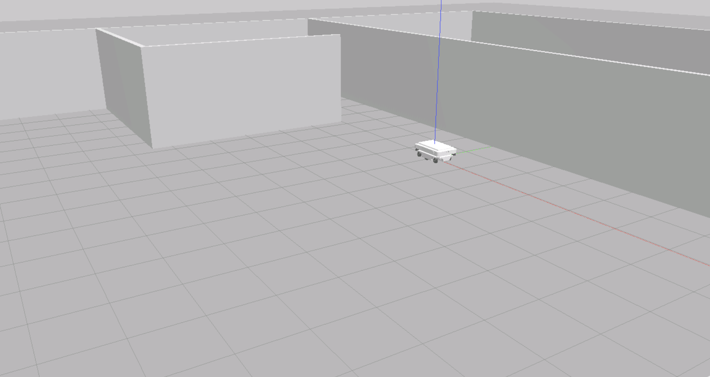
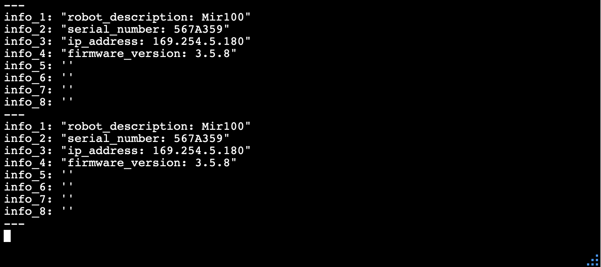
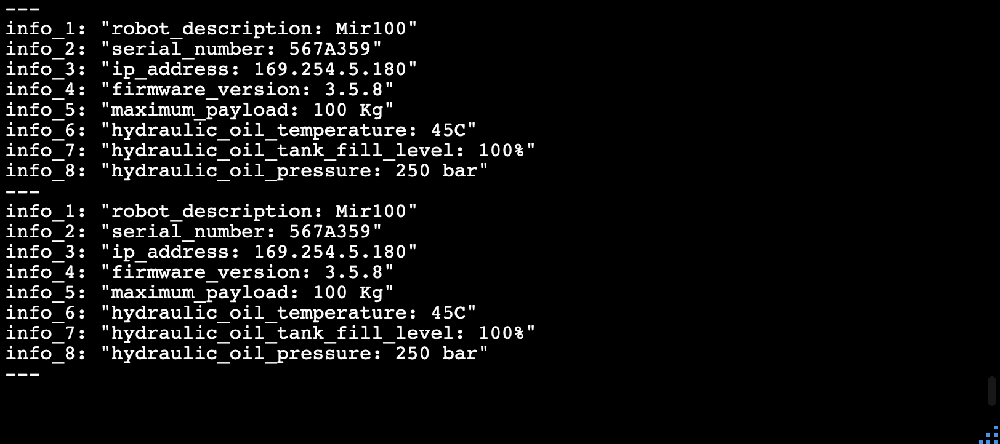
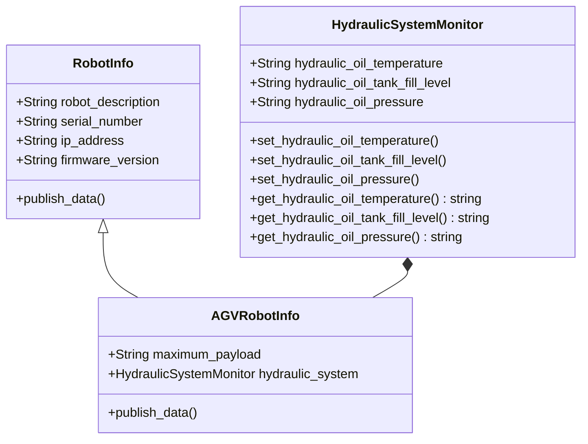

# Robot Info (Node)

Target is to develop a user-friendly graphical interface that even those with little or no previous experience in robotics can use to interact with the robots remotely. The system uses several ROS nodes communicating with each other and the graphical interface build using [cvui](https://dovyski.github.io/cvui/) library. The system involves tree important functions (nodes) to work properly:

- **Robot GUI** : GUI application functions as a ROS node to communicate and displays data on the user's screen
- **Robot Info** : provides relevant information about the robot, such as the robot name and the current status of its systems
- **Distance Tracker** : calculates the distance traveled by the robot using the odometry data and work as service.

 

## Structure

```text
.
├── CMakeLists.txt
├── include
│   └── robot_info
│       ├── agv_robot_info_class.h
│       ├── hydraulic_system_monitor.h
│       └── robot_info_class.h
├── msg
│   └── Packet.msg
├── package.xml
├── README.md
└── src
    ├── agv_robot_info_class.cpp
    ├── agv_robot_info_main.cpp
    ├── hydraulic_system_monitor.cpp
    ├── robot_info_class.cpp
    └── robot_info_main.cpp
```

## Setup

#### Distribution

Use docker for quick-start (for both ROS1 or ROS2):

```sh
# using docker for ROS1
$ docker run -ti --rm --name local-ros-noetic ros:noetic
```

```sh
# using docker for ROS2
$ docker run -ti --rm --name local-ros-humble ros:humble
```

#### Build (Package)

Now, create a catkin workspace, clone the package:

```sh
# setup directory
$ mkdir ~/catkin_ws/src/
$ git clone <repo_name> ~/catkin_ws/src/
```

Install the required packages (dependency) mentioned in `package.xml` using `apt`:

```sh
# check if package is available
$ rospack list
$ rosnode list
```

```sh
# update path to installed packages
$ export ROS_PACKAGE_PATH='/home/user/catkin_ws/src:/opt/ros/noetic/share'
```

To build locally or inside docker use the following commands:

```sh
# execute build
$ cd ~/catkin_ws & catkin_make
$ source devel/setup.bash
```

## Robot (MiR100)

The `MiR100` is autonomous mobile robots that quickly automates internal transportation and logistics. The `MiR100` is four wheel robot which can run up-to `1.5 m/s` (max speed) and transfer up `100 Kg` payload.

To download the robot environment clone the repository:

```sh
git clone https://bitbucket.org/theconstructcore/advanced_cpp_auxiliary_pkgs.git ~/catkin_ws/src/
```

To launch the robot in gazebo simulation (by default, physics is in paused state on simulation start):

```sh
roslaunch mir_gazebo mir_maze_world.launch
```



## Node

The `robot_info_main.cpp` initialize **RobotInfo** class object and `agv_robot_info_main.cpp` initialize **AGVRobotInfo** class object, both the class uses `/robot_info` topic to communicate the robot system information using a custom message to communicate `Packet.msg` as defined below:

- the message consist of 8 fields from`info_1` to `info_8`
- all the message fields consist of type string.

To run the `robot_info_node` node open two terminals, source and execute the following commands:

```sh
# terminal 1
$ rosrun robot_info robot_info_node
```

```sh
# terminal 2
$ rostopic echo /robot_info
```



To run the `agv_robot_info_node` node open two terminals, source and execute the following commands:

```sh
# terminal 1
$ rosrun robot_info agv_robot_info_node
```

```sh
# terminal 2
$ rostopic echo /robot_info
```



## Specifications

#### Class Diagram



#### Field Description

**RobotInfo** :

- `robot_description`: robot description (like name or brand).
- `serial_number`: robot's serial number.
- `ip_address`: robot's current IP address.
- `firmware_version`: robot's firmware version.
- `publish_data()` : method to publish on topic `/robot_info`.

**AGVRobotInfo** :

- `maximum_payload` : maximum weight the robot can transport.
- `publish_data()` : method to publish on topic `/robot_info`.

**HydraulicSystemMonitor** :

- `hydraulic_oil_temperature` : the temperature of the hydraulic oil.
- `hydraulic_oil_tank_fill_level` : hydraulic oil fill level.
- `hydraulic_oil_pressure` : monitoring the pressure of hydraulic system.

## Roadmap

- [x] Part 1 : Create `robot_info_node` and `agv_robot_info_node`.

- [ ] Part 2 : Create `/get_distance` service node.

- [ ] Part 3 : Create `robot_gui_node` for robot control.

See the [open issues](https://github.com/llabhishekll/python-project-template/issues) for a full list of proposed features (and known issues).

## Tools

System tool/modules used for project development.

- `Applications` : [vs-code](https://code.visualstudio.com/), [ros-extensions](https://marketplace.visualstudio.com/items?itemName=ms-iot.vscode-ros) and [docker-desktop](https://docs.docker.com/get-docker/).
- `ROS` : [ros-docker-images](https://hub.docker.com/_/ros/) (`humble`, `noetic`) or [build-source](https://www.ros.org/blog/getting-started/).

## License

Distributed under the MIT License. See `LICENSE.txt` for more information.
